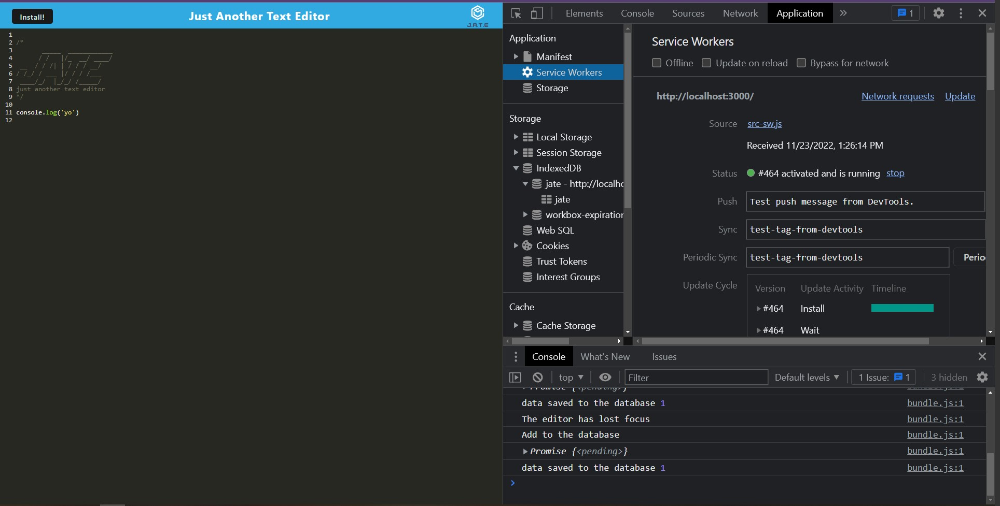

# Chazs PWA Text Editor

## Descripton
A full stack application that uses a JavaScript text editor format and adds a offine functionality via service worker with desktop installation.
https://pwa-text-editor-chaz.herokuapp.com/

## Table of Contents
  * [Installation Instructions](#installation-instructions)
  * [Application Usage](#application-usage)
  * [Contributors](#contributors)
  * [Licenses](#licenses)
  * [Tests](#tests)
  * [Contact Me](#contact-me)

## Installation Instructions
Before running this application you must install -please `npm init`, `npm install`, Then run `npm start` to build the application.

## Application Usage
-The usage is to keep track of users thoughts via text.

## Contributors
By Chaz Graham

## Licenses
This application is licensed under: None

## Tests
To test application open the console and run the following comand: none

## Contact Me
If you have additional questions you can contact me at https://github.com/chazgraham